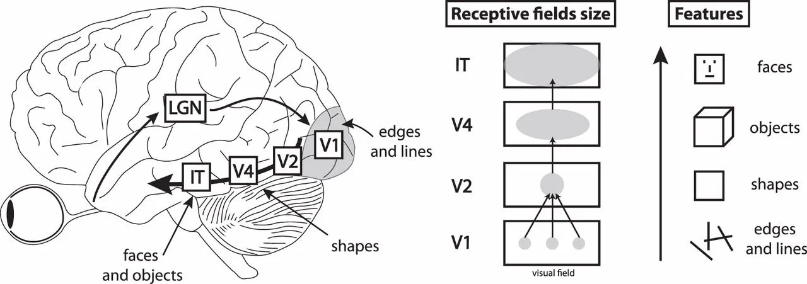

tags:: Neuroscience, Hebbian Natural Abstractions, Hebbian Learning, Natural Abstractions Hypothesis, AI Alignment, Human values, Computational Neuroscience, Mathematics

- {:height 327, :width 279}
- **TL;DR:** We showed how Hebbian learning with weight decay can enable a) feedforward circuits (one-to-many) to extract the first principal component of a barrage of inputs and b) recurrent circuits to amplify signals which are present across multiple input streams and suppress signals which are likely spurious.
- # Short recap
	- In the [last post]([[Introduction to "Hebbian Natural Abstractions"]]) we introduced the following idea:
	- We don’t have a way to formalize concepts and transfer them so that an alien agent understands them. Think back to the tree conversation - how would you describe a tree to an AGI?
	- Yet, we aren’t facing the same issues when communicating concepts between humans.
	- We concluded that this must have something to do with how the brain learns.
- # Introduction
  
  In this post, we introduce a learning rule that is (presumably) used by biological brains and connect it with the type of circuits that emerge in the brain under different types of input. This connection will serve as the mathematical foundation for our exploration of how the brain forms natural abstractions.
- We will consider two scenarios in the brain: (a) how the brain learns in a "many-to-one" setup, where several neurons project onto a single neuron in another layer, and (b) how the brain learns in an "all-to-all" setup, where several neurons in a layer connect to each other.
- The current post tries to make the derivations accessible, but still focuses on the mathematics. In the next post, we will discuss implications of our derivations by delving into neuroscience and related topics.
  ---
- # **Definitions and notation:**
  
  **Notation used in this post:**
- $\langle x_i \rangle$ refers to the statistical average of a variable $x_i$.
- $x_i$ and $x_j$ refer to the activation of neuron i and neuron j. Without loss of generality, we will assume that the activity of all neurons centers around 0, so that $\langle x_i \rangle = 0.$
- $w_{ij}$ refers to the strength of the synapse connecting neuron i to neuron j. A higher weight implies a higher likelihood of neuron i triggering neuron j.
- We define the output of single a neuron as $y = \sum_{i=1}^n w_ix_i$.
- We will use the delta notation for derivatives, i.e. $\Delta w_{ij} = \frac{dw_{ij}}{dt} = \overset{.}w_{ij}$. This means that from $t$ to $t+1$, the weight changes with: $w_{ij}(t+1) = w_{ij}  + \Delta w_{ij}$.
- For the derivations, we will switch into vector notation at some places. When we do that, we remove indices and make the letter bold.
- **Definition** **Natural abstractions:** *Abstractions are lower-dimensional but high-level summaries of the things ‘out there’. Often, we can find abstractions that are relevant ‘further ahead (causally, but also in other senses)’ for prediction. They are natural in the sense that we expect a wide selection of intelligent agents to converge on them* ([Wentworth, 2021](https://www.alignmentforum.org/posts/cy3BhHrGinZCp3LXE/testing-the-natural-abstraction-hypothesis-project-intro))*.*
- **Definition [Hebbian learning:](https://www.wikiwand.com/en/Hebbian_theory)** While there is a [plethora of learning rules](https://www.annualreviews.org/doi/abs/10.1146/annurev.neuro.31.060407.125639), with varying degrees of biological relevance and plausibility, most rules are derivates of the [Hebbian principle](https://www.notion.so/Hebbian-Natural-Abstractions-Introduction-8d6313e54ea14b678c76ce718de8cdbb?pvs=21): *neurons that fire together wire together* (attributed to [Carla Shatz](https://stanmed.stanford.edu/carla-shatz-vision-brain/#:~:text=Those%20results%20eventually%20led%20Shatz,up%2C%20while%20others%20are%20pruned))*.* Thus, *an increase in synaptic efficacy arises from a presynaptic cell's repeated and persistent stimulation of a postsynaptic cell.* The naive implementation of this principle ($\Delta w_{ij} = x_ix_j$) is unstable, i.e. the numerical values of the weights grow indefinitely (see **Appendix**). To resolve this instability, variations of Hebbian learning have been proposed¹.
- **Definition Hebbian learning with weight decay:** For the sake of simplicity, we will focus on one of the simplest variants of Hebbian learning, [Hebbian learning with linear weight decay](https://neuronaldynamics.epfl.ch/online/Ch19.S2.html#:~:text=synapses%20spontaneously%20decay%20back%20to%20zero):
  
  $$
  (1) \ \small{\text{Hebbian learning with weight decay}}\ \\\; \tau_w\Delta w_i = x_iy-\rho w_i
  $$
  
  Here, $\tau_w$ represents a time constant that regulates the speed of learning. $\rho$ is a scalar decay factor that controls the speed of weight decay. This rule has several key advantages:
	- the rule is stable, i.e. it avoids Hebbian runaway dynamics (see **Appendix**).
	- the rule is biologically plausible in that homeostatic downregulation of large synapses appears as a key mechanism for memory consolidation ([Torrado Pacheco et al., 2021](https://pubmed.ncbi.nlm.nih.gov/33232655/)).
	- weight decay is important for training deep neural networks, where it acts as a natural regularizer for improved generalization ([Xie et al, 2021](https://arxiv.org/abs/2011.11152)).
- The structural simplicity of the rule also allows for clean derivations in the rest of this article. We can also derive equivalent results with other rules².
  
  ---
- # The Setup
  
  A classic framework for understanding information processing in the biological brain is the [hierarchical processing framework](https://universalprior.substack.com/p/serendipitous-connections-applying?utm_source=substack&utm_campaign=post_embed&utm_medium=web). In this framework, sensory information enters the brain through the sensory organs (eyes, ears, taste buds, olfactory system, somatosensory system, …). This information then progresses through layers on the cortical hierarchy. At each step of the hierarchy, neural circuits process the sensory information and integrate it into a coherent whole with prior information. The further up in the cortical hierarchy a neuron lives, the higher-order the information that neuron processes will be.
  
  {:height 33, :width 514}
	- Hierarchical processing in the ventral stream. ([Manassi et al 2013](https://jov.arvojournals.org/article.aspx?articleid=2193828))
- While the classic framework has limitations³, it still provides a useful approximation of information processing in the biological brain. We focus on two abstract circuits that are ubiquitous throughout the classic framework:
- **Feedforward circuit**: Given two distinct populations of neurons, how does the brain learn the appropriate neural projections from one population to the other? Generally, the feedforward circuit is a "many-to-one" setup, where several neurons project onto a single neuron in another layer.
  
  
- **Recurrent circuit**: Given a population of neurons, how does the brain learn the appropriate connections of neurons within the circuit? Generally, we interpret a recurrent circuit as a "all-to-all" setup, where several neurons in a layer connect to each other. Even though in practice not all neurons connect with all other neurons, we can still apply the all-to-all setup, where most of the connection strengths are set to zero (see [Ko et al., 2011](https://www.nature.com/articles/nature09880) for some biological background).
  
  
- ## ‘Many-to-one’: Feedforward circuits - analysis
  
  
  
  In this scenario individual neurons that receive multiple of inputs from another population of neurons (as is the case for pyramidal neurons in layer 2/3 of the cortex). Speaking in terms of information processing, each neuron faces the task of extracting “*relevant*” information from a barrage of synaptic inputs. So, the neuron has to prioritize some inputs over others, depending on its role in the circuit. This role emerges during early brain development in an activity-dependent fashion through the flexible self-organization of neural circuits ([Kirchner, 2022](https://universalprior.substack.com/p/the-brain-that-builds-itself)).
  
  $$
  (1) \ \small{\text{Hebbian learning with weight decay}}\ \\\; \tau_w\Delta w_i = x_iy-\rho w_i
  $$
  
  We model the activation of the target neuron, $y$, as the weighted sum over all presynaptic inputs, $x_j$:
  
  $$
  y = \sum_{j}^nw_jx_j
  $$
  
  Given this characterization, we can plug the equation for the activation of the target neuron into equation (1) to arrive at a formulation of the weight dynamics in terms of presynaptic activity:
  
  $$
  \tau_w\Delta w_i = \sum_{j}^nw_jx_jx_i-\rho w_i
  $$
  
  As we care about the connectivity of the circuit at the end of development, we can assume that the system is in steady state, i.e. $\tau_w\langle \Delta w_i \rangle =0$, to arrive at
  
  $$
  \rho w_i = \sum_{j}^nw_j \langle x_jx_i\rangle
  $$
  
  or, in vector notation,
  
  $$
  \rho\bold{w} = \bold{x}^T\bold{x}\bold{w}.
  $$
  
  Let’s equate $\bold{x}^T\bold{x}$ with the covariance matrix of the inputs, $\bold{C}$, under the assumption that the average activity of the inputs centers around zero⁴.
  
  $$
  \overset{\bold{C}\  := \ \bold{x}^T\bold{x}}\implies \rho\bold{w}= \bold{C}\bold{w}.
  $$
  
  We recognize that this equation is the [eigenvector equation](https://www.wikiwand.com/en/Eigenvalues_and_eigenvectors), i.e. we learn that the vector of synaptic weights, $\bold{w}$, should be an eigenvector of the covariance matrix, $\bold{x}^T\bold{x}$. Under [reasonable assumptions](http://www.scholarpedia.org/article/Oja_learning_rule#Oja_learning_rule_and_principal_component_analysis), we can furthermore derive that $\bold{w}$ will be proportional to the eigenvector of the covariance matrix with the largest eigenvalue ([Oja, 1983](https://openlibrary.org/books/OL3172585M/Subspace_methods_of_pattern_recognition); [1992](https://www.sciencedirect.com/science/article/abs/pii/S0893608005800899)).
  
  In summary, a neuron in the feedforward circuit will learn to extract a principal component of its input:
  
  
  
  Each red arrow indicates the extracted principal component that emerged through Hebbian learning of input weights.
  
  We have arrived at the principal component by deriving it as the eigenvector of the covariance matrix. Interestingly, principal component analysis identifies the eigenvector *corresponding to the largest eigenvalue of the covariance matrix* as the projections of the input space that [retain the largest amount of variance](https://www.wikiwand.com/en/Principal_component_analysis#:~:text=First). In our case, this is the weight vector $\bold{w}$ at the point of convergence.
  
  In later posts, we will expand on our observations in this post, where we also show the connection between maximizing projected variance and maximizing mutual information. This connection will be crucial for understanding how natural abstractions can arise in the biological brain.
- ## ‘All-to-All’: Recurrent circuit - analysis
  
  The second important component of the hierarchical processing framework is the recurrent circuit. In this circuit, individual neurons within a population interconnect, creating a network that allows information to pass back and forth between neurons. This type of circuit is important for tasks like memory and pattern recognition, where information from multiple sources is integrated and processed over time.
  
  
  
  In the recurrent circuit we have to consider a quadratic number of possible connections, $w_{ij}$, rather than the linear number of connections from the feedforward circuit, $w_j$. In particular, the rule for Hebbian learning with weight decay now becomes
  
  $$
  (1') \ \small{\text{Hebbian learning with weight decay in a recurrent network}}\ \\\; \tau_w\Delta w_{ij} = x_ix_j-\rho w_{ij}
  $$
  
  Here we assume that the feedforward input into neurons $i$ and $j$ dominate the activity variables, $x_i$ and $x_j$. This connects to the insight we gained in the last section: each neuron in the population receives a barrage of inputs and has to prioritize. Thus, the activity variables $x_i$ and $x_j$ depend on the inputs received from the previous layers. This assumption is biologically plausible, as sensory stimulation indeed dominates neural activity ([Alenda et al., 2010](https://www.jneurosci.org/content/30/32/10872); [Stringer et al., 2019]([https://www.science.org/doi/10.1126/science.aav7893](https://www.science.org/doi/10.1126/science.aav7893)]([https://www.science.org/doi/10.1126/science.aav7893](https://www.science.org/doi/10.1126/science.aav7893)))) and recurrent connections become more important in the absence of sensory stimulation ([Litwin-Kumar et al., 2014](https://www.nature.com/articles/ncomms6319)).
  
  When writing the Hebbian learning rule thus, we can again introduce a steady state assumption, i.e. $\tau_w\langle \Delta w_i \rangle =0$, to investigate the circuit connectivity at the end of development:
  
  $$
  w_{ij} = \frac{1}{\rho}\langle x_ix_j\rangle ,
  $$
  
  or in matrix notation, $\bold{W}=\frac{1}{\rho}\bold{C}$. In the case of a recurrent circuit, the structure of the circuit ends up mirroring the correlational structure of the input. Each synaptic connection between two neurons corresponds to an entry in the covariance matrix. This means that the recurrent activity of the circuit will amplify signals that are present across multiple input streams, and suppress signals that don’t (and are thus likely spurious).
- # Limitations and up-next
  
  The material in this post is by no means novel, and is (with many variations) well-established introductory material in computational neuroscience. Still, wrinkles in the above story continuously appear and many PhD theses are written about those wrinkles, so we stress that we do not aim to provide a full picture but only a first-order approximation.
  
  In the next post, we want to list and explain (some of) the empirical evidence from neuroscience that corroborates the theory we outlined in this post.
  
  ---
- # Footnotes
- See [Oja’s rule](http://www.scholarpedia.org/article/Oja_learning_rule)**,** [BCM rule,](http://www.scholarpedia.org/article/BCM_theory) ****[Heterosynaptic STDP](https://www.ncbi.nlm.nih.gov/pmc/articles/PMC3787503/) and [balanced inhibitory plasticity](https://journals.plos.org/ploscompbiol/article?id=10.1371/journal.pcbi.1010682) for more information.
- For a similar derivation for Oja’s rule, see [this article](http://www.scholarpedia.org/article/Oja_learning_rule).
- For example, it neglects [feedback connections](https://onlinelibrary.wiley.com/doi/10.1002/cne.23458) and [multimodality](https://www.science.org/doi/10.1126/science.292.5523.1791a).
- Note that we assumed above that the average activity of all cells is zero, which justifies us calling $\bold{x}^T\bold{x}$ the covariance matrix. We leave it to the motivated reader to convince themselves that the derivation also works with non-zero average firing rates and an appropriate offset in the learning rule.
  
  ---
- # Appendix
  
  **Why is pure Hebbian learning biologically implausible?**
  
  See this graph, that shows, for 250 iterations with a learning rate of 0.1, how the output of the Hebbian learning algorithm behaves and develops:
  
  
  
  Here are the plotted weight vectors  $\in \mathbb{R}^2$, also for 250 Iterations:
  
  
  
  This shows, that with enough iterations, the weights of neurons equipped with Hebbian learning grow explosively - there is no decay term that limits their growth.
  
  In contrast, Hebbian learning with a linear weight decay term is relatively stable:
  
  <!-- notionvc: 74bf37cb-a2f9-4759-82b7-9343d8a7eced -->