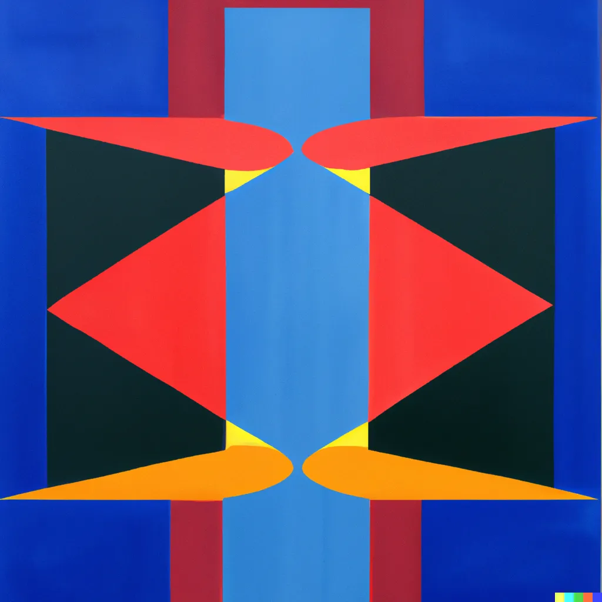

tags:: Personal, Accountability, Productivity, Life

- {:height 786, :width 778}
- # TL;DR:
  
  An accountability buddy is someone to check in with from time to time to give you social motivation to achieve your goals. There are many additional benefits from this process such as planning together and getting feedback on your progress. I think especially EAs in remote areas or those doing EA-related work, or upskilling part-time would benefit from having an accountability buddy. If you’d like to try it out, put your details down [in this table](https://docs.google.com/spreadsheets/d/143Z16crSfv9BB2dn5eaoseT0ZpbMVaizBASL43eXJ7s/edit#gid=0).
  
  *This is partly a post about increasing your productivity. For more ideas check [Effective Self-Help’s long list of recommendations](https://forum.effectivealtruism.org/posts/x7udP4eQqm4WJ9mFo/a-database-of-effective-productivity-recommendations).*
  
  *Thank you to Evander and Anabel for your feedback.*
  
  Epistemic status: We have had first-hand experience with accountability buddies for the past six months + reflected on the process several times. We’ve also had conversations with others about the topic. Overall our views should be taken as a motivation to experiment instead of a laid-out path.
  
  Author’s note: The first-person perspective in this post is taken in by Konstantin. Other remarks by Sam are marked with S or found summarized here. Nevertheless, we wrote most of this article collaboratively. Furthermore, this article is a concrete outcome of our rejection challenge.
- # Motivation for having an accountability buddy
  
  I think I wouldn’t be where I am today if I hadn’t met Sam, my accountability buddy at EAG London this year. Our regular meetings made me more structured, helped me frequently reflect on my goals and progress, and made me more ambitious than I was before. I think many, if not all people would benefit from some form of accountability partnership and I encourage you to give it a try if you haven’t.
  
  In an abstract sense, an accountability buddy (AB) is someone to help you better reflect and achieve your goals, either through indirect accountability (”I told them I’d get this done this week and it’s already Thursday, so I better get going!”) or direct accountability (“Hey, didn’t you say you wanted to start that project? How is that going?”). The most common way of doing this is by meeting regularly and going through past progress and future goals.
  
  In addition to accountability, an AB can help you to reflect on your goals and the progress you made toward them. If it works out well, an accountability session can feel like a mini-coaching every week.
  
  I think many people would benefit from accountability buddies, especially if they:
- Live in a location where EA interactions occur infrequently
- Work on EA causes part-time or in their free time
- Struggle to make progress on long-term goals such as career planning or particular projects
- Find it hard to stay motivated
- Lack a social environment that supports their work
- Have several goals that they find hard to prioritize among
  
  There are also some related concepts that I may one day write about: career planning groups (e.g. [for the 80k course](https://www.facebook.com/groups/928373221340185)), holding you accountable to make progress and discussing your plans and value buddies, someone you reflect your values with on a regular basis to keep track of [value drift](https://forum.effectivealtruism.org/topics/value-drift).
- # Benefits
- In order to talk about your plans, you have to plan. To communicate your goals for the coming week, you’ll have to formulate them well, which often shows you flaws or failure modes.
- You get feedback. A good accountability buddy will tell you when they think you’ve set too many objectives for the next week or if you are ignorant of something. They can also give some object-level stance on how likely you’ll be to complete certain tasks and if your approach is promising.¹
- You also learn and grow together. If you see that your buddy is doing something you haven’t thought about before but that you could do as well, then you feel inclined to do it as well. In a way, holding each other accountable also leads to healthy competition and trying to be more ambitious.²
- You become more agentic. We were very excited when we read “[Seven Ways To Become Unstoppably Agentic](https://eviecottrell.com/blog/seven-ways-to-become-unstoppably-agentic)” by Evie Cottrell a few months ago. We quickly set up a rejection list and challenged each other to get more rejections. We also discussed on a weekly basis whether we could think of somebody in our immediate or not-so-immediate social network that could help us with one of our current problems. Reading the blog post together and aiming to be more agentic in the future was quite impactful for both of us. I am unsure whether I would have applied for funding or asked for mentoring if not for this dynamic.
- You grow as a person. With time your AB will not only learn to give feedback to your planning and goal setting but more broadly to you as a person. This has been a powerful mechanism for my character development.
- Having someone to report your progress to makes you feel supported and enables you to be more ambitious.
- You may gain a new friend. Having someone to tell how you are doing and how you feel is one of the best ways to connect with someone. Sharing so explicitly and openly naturally lets you grow together and develop a strong friendship (if you want this to happen, I think you can also do this on a completely professional level).
- You feel more connected to EA. Talking to an EA can be very enjoyable and beneficial, especially for those who don’t have much contact to EAs in their everyday life. It definitely helped me implement more EA-related reading and work into my everyday life and was great to reflect on my career plans.
- You gain a valuable support structure. I think even before becoming friends it feels great to have someone who knows about your goals and you feel reassured. Besides that, you also have a person to talk about EA-related, and non-EA-related struggles, e.g., pressure, hustle culture, or EA-relationships talk
- # Downsides & Failure modes
- It can get pretty intense socially. If you have mental health issues or otherwise tend to feel guilty about not getting done what you think you should have, having to report this to someone and hearing how they made progress can be demotivating.³
	- However, I think having someone to listen to your struggles and hearing that your accountability buddy also has problems can be very comforting. Furthermore, an AB can help you set realistic goals which can help you not to feel overwhelmed as easily.
- Your friendship and conversations will, in the best case, get pretty deep pretty quickly. This can sometimes feel weird. How can I talk with this person about e.g., how my unhealthy relationship hinders me in achieving my goals if I’ve barely known them for three weeks?
	- To avoid this, I suggest starting with a minimal version of accountability where you simply talk about some concrete tasks. As you develop trust, you can additionally talk about more personal things.
- Accountability itself is neutral. If you realize one of the goals you set was misguided, being held accountable for it can be bad.
	- S: *I felt something like this when I was overwhelmed after hanging out at the legendary PrEAGxBerlin flat. I felt like I couldn’t continue on the path I was, and telling something along those lines to my accountability buddy felt weird and frightening.*I think it can easily happen that you know you’d benefit from taking some time off but feel pressured by your AB to work more. However, ideally, if you make this explicit, your AB might even be able to help you develop a healthier working routine.
- The closer you grow, the more your accountability buddy gets to know you. Subsequently, your AB loses the valuable outside perspective.
	- On the other hand, the feedback you get will be more personal, which can be very helpful. One idea here is to change your AB from time to time so you get different perspectives. However, we haven’t tried that yet.
- For some highly structured people, spending time with your AB might be less valuable compared to reflecting by yourself.
	- However, even if you think that is likely the case, I suggest you still give it a try. I was surprised how much I benefitted despite already having been a very structured person.
- # How does it work concretely?
  
  I think there are many ways you can make an accountability partnership work. A simple form is just meeting up once a week and sharing your goals for the next few days.
- ## 0) Think about what you want
  
  Was there something we mentioned you’d like to have? Is there something else an AB could help you with? Do you think you’d benefit from an accountability partnership?
- ## 1) Finding an AB
  
  Your AB should ideally be:
- Broadly familiar with the work you usually do, ideally, you work in the same field
- Be in a similar personal situation, e.g., if you’re at university, having another student as AB will likely be most helpful
- Live close to you (though we’ve met up online 90% of the time which has worked fine)
  
  Ideas for where to find them:
- Write in your Swapcard profile at the next EAG(x) that you’re looking for one
- Ask some friends
- **Put your name down [in this table](https://docs.google.com/spreadsheets/d/143Z16crSfv9BB2dn5eaoseT0ZpbMVaizBASL43eXJ7s/edit#gid=0)**
	- We don’t plan to monitor this, so feel free to improve it and be pro-active about reaching out.
	  
	  I found Sam because he wrote he was looking for an AB in Swapcard at EAG London. We first had a trial period of a couple of meetings and then decided we wanted to stick to it.
	  
	  Don’t be disappointed if you don’t fully resonate with the first AB you picked. Try finding someone else and experiment a bit.
- ## 2) Setting up a structure
  
  Schedule a regular time you meet up to discuss your plans and share your goals for the next week.⁴ I think you get the most value from it if you include a reflection on the last week.
  
  If you want to take it further, you can design a template (see Appendix for our template) you complete each week (e.g., by silent coworking) and then talk about the results. Another idea is to include a debugging session at the end of the meeting.
- ## 3) Regularly reflect on the accountability partnership
  
  Would it help you to have brief daily check-ins in addition to your weekly planning? Do you feel like you could shorten the meeting without losing many benefits? Do you think additional monthly planning might be helpful? Do you feel comfortable sharing your personal life or would you rather just talk about your work-related goals?
- # Some things we would do differently now or learned along the way
  
  The style of our meetings and the relationship with Sam changed considerably over the last months. Here are some learnings we’d like to pass on:
- Have a minimal version that you can do if you have a very stressful week. Ideally, also have a version that works without having to meet (e.g., by just sharing your plan for the next week). This makes it much easier to keep up the habit.
- Don’t [goodhart](https://en.wikipedia.org/wiki/Goodhart%27s_law) filling in templates. Try to focus on productive reflection and planning. If you feel like your template is not helping, throw it.
- Spend some time on the meta-level. Review how your planning procedure is working from time to time and improve it.
- Have a [rejection list](https://forum.effectivealtruism.org/posts/Pc3CFbYxPXgyjoDpB/seven-ways-to-become-unstoppably-agentic)
- # Conclusion
  
  If you think you may benefit from any of the advantages outlined above, why not just try this out and **put your name into [the database](https://docs.google.com/spreadsheets/d/143Z16crSfv9BB2dn5eaoseT0ZpbMVaizBASL43eXJ7s/edit#gid=0)**!
  
  If you already have an accountability buddy or you had one once, please share your experiences & templates in the comments.
  
  ---
- # Appendix:
- ## Meeting Outline
  
  Here’s our suggested meeting outline, which we changed quite heavily over time.
- Check-In with [tscheck.in](https://tscheck.in/)
- What’s our time limit this week?
- Mini-Retro:
	- What was great about our last meeting?
	- What wasn’t great about our last meeting?
	- What are we going to do differently this time?
- Verbal recap of last week (see Template)
- Written recap of the last week and sharing
- Written planning for the next week and sharing
- Optionally, debugging session.
- Check-Out with [tscheck.in](https://tscheck.in/)
- ## Template
  
  Here’s our [template](https://www.notion.so/Weekly-Planning-8fe6b173f5a344b48f9806de8286361e?pvs=21). While it is in Notion, the basic template should work elsewhere too (e.g. copy it to google docs). If you have any technical difficulties, contact [Sam](https://t.me/+4915228982798). Our process takes about an hour, though it can be shortened by skipping questions. (We usually take more time because we tend to chat a lot about what the other person has been up to - we think that’s super valuable, so we try to plan accordingly.)
  
  For a 15-minute version check [this post](https://forum.effectivealtruism.org/posts/2RvpoWWQDiFpptpam/accountability-buddies-a-proposed-system-1#comments).
  
  ---
- # Footnotes
- “Are you sure you want to pick up on linear algebra by just studying this book? There’s a great [3Blue1Brown](https://www.youtube.com/watch?v=kjBOesZCoqc&list=PL0-GT3co4r2y2YErbmuJw2L5tW4Ew2O5B) video series on the topic.”
- “Oh, you’re already writing another blog post? Maybe I’d like to take some time to write as well this week.”
- If you struggle with guilt, I really recommend the [Replacing Guilt series](https://mindingourway.com/guilt/) by Nate Soares.
- We found that Sunday night works best as it’s a natural reflecting time and we are both free then anyways.
  
  <!-- notionvc: 622a6064-2cbd-49c6-9cdc-746d17abe707 -->